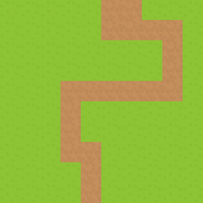
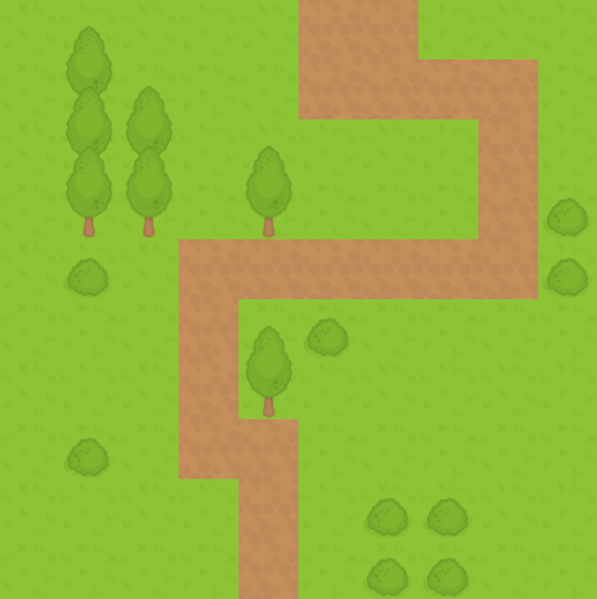

# canvas-tile-map

This package allows you to create a tile map game using an HTML Canvas element, and a few lines of JavaScript.

## Table of Contents

- [Install](#install)
- [Usage](#usage)
- [Settings](#settings)
  - [Required Settings](#required-settings)
  - [Sprite Sheet](#sprite-sheet)
  - [Layers](#layers)
      - [Single Layer](#single-layer)
      - [Multiple Layers](#multiple-layers)
- [Additional Settings](#additional-settings)
    - [Camera](#camera)
    - [Character](#character)
- [Examples](#settings)
- [License](#license)

## Install

Using [node](https://nodejs.org) and [npm](https://npmjs.com), run:

```sh
npm install --save canvas-tile-map
```

## Usage

Add a canvas element somewhere in your HTML file, and give it an ID:

```html
<canvas id="tile-map"></canvas>
```

Then in a JavaScript file:

```js
var Game = require('canvas-tile-map').Game;

var settings = {
    // put your settings here
};
var game = new Game(setting);
game.run();
```

Add your JavaScript file to your HTML using [Browserify](http://browserify.org/), [Webpack](https://webpack.github.io/), or anything, and you're all set!

## Settings

The settings object you create holds all of the information of your game. There are many optional settings to fully customize your game, but only a few are required.

### Required Settings

- **canvasID**: The ID you assigned to your canvas element
- **map**: An object containing features of your map
    - **layers**: A list of matrices containing the layout of your tiles (see [layers](#layers))
    - **tileHeight**: The height of each tile in pixels
    - **tileWidth**: The width of each tile in pixels
    - **spriteSheet**: An object containing information about your spritesheet (see [Sprite Sheet](#sprite-sheet))
        - **src**: The location of the file
        - **imageCount**: The # of sprites in the sheet
        - **imageHeight**: The height of each sprite in pixels
        - **imageWidth**: The width of each sprite in pixels

example:
```js
var settings = {
    canvasID: "tile-map"
    map: {
        layers: layers
        tileHeight: 50
        tileWidth: 50
        spriteSheet {
            src: "path/to/spriteSheet.png"
            imageCount: 5
            imageHeight: 64
            imageWidth: 64
        }
    }
}
```


### Sprite Sheet

The sprite sheet is one file contains all of the images(sprites) you'd like to use as tiles. The sprites should all be the same size and should aligned horizontally.

Each sprite will be assigned a number starting with 1. That number will be used as a reference to that sprite.

Here is an example:

```js
spriteSheet: {
    src: './images/tiles.png',
    imageCount: 5,
    imageHeight: 64,
    imageWidth: 64
}
```
would be:


### Layers

Layers respresent the entire layout of your map's tiles. Use the number references to your [sprite sheet](#sprite-sheet) to create a grid of your map.

#### Single Layer

```js
var layers = [
    [
        [1, 1, 1, 1, 1, 2, 2, 1, 1, 1],
        [1, 1, 1, 1, 1, 2, 2, 2, 2, 1],
        [1, 1, 1, 1, 1, 1, 1, 1, 2, 1],
        [1, 1, 1, 1, 1, 1, 1, 1, 2, 1],
        [1, 1, 1, 2, 2, 2, 2, 2, 2, 1],
        [1, 1, 1, 2, 1, 1, 1, 1, 1, 1],
        [1, 1, 1, 2, 1, 1, 1, 1, 1, 1],
        [1, 1, 1, 2, 2, 1, 1, 1, 1, 1],
        [1, 1, 1, 1, 2, 1, 1, 1, 1, 1],
        [1, 1, 1, 1, 2, 1, 1, 1, 1, 1]
    ]
];

var settings = {
    layers: layers
    // etc.
};
```
would make:



**Note** The 'layer' is nested inside the list of `layers`

#### Multiple Layers

To support multiple layers, simply add more layers to your `layers`

```js
var layers = [
    [ // base layer
        [1, 1, 1, 1, 1, 2, 2, 1, 1, 1],
        [1, 3, 1, 1, 1, 2, 2, 2, 2, 1],
        [1, 3, 3, 1, 1, 1, 1, 1, 2, 1],
        [1, 3, 3, 1, 3, 1, 1, 1, 2, 1],
        [1, 1, 1, 2, 2, 2, 2, 2, 2, 1],
        [1, 1, 1, 2, 1, 1, 1, 1, 1, 1],
        [1, 1, 1, 2, 3, 1, 1, 1, 1, 1],
        [1, 1, 1, 2, 2, 1, 1, 1, 1, 1],
        [1, 1, 1, 1, 2, 1, 1, 1, 1, 1],
        [1, 1, 1, 1, 2, 1, 1, 1, 1, 1]
    ],
    [ // a layer with some bushes & trees
        [0, 4, 0, 0, 0, 0, 0, 0, 0, 0],
        [0, 4, 4, 0, 0, 0, 0, 0, 0, 0],
        [0, 4, 4, 0, 4, 0, 0, 0, 0, 0],
        [0, 0, 0, 0, 0, 0, 0, 0, 0, 5],
        [0, 5, 0, 0, 0, 0, 0, 0, 0, 5],
        [0, 0, 0, 0, 4, 5, 0, 0, 0, 0],
        [0, 0, 0, 0, 0, 0, 0, 0, 0, 0],
        [0, 5, 0, 0, 0, 0, 0, 0, 0, 0],
        [0, 0, 0, 0, 0, 0, 5, 5, 0, 0],
        [0, 0, 0, 0, 0, 0, 5, 5, 0, 0],
    ]
];

var settings = {
    layers: layers
    // etc.
};
```
would make:



## Additional Settings

### Camera

The camera is the viewport for the portion of the map that is currently being shown. If the camera's dimensions are smaller than the map, then the arrow keys on the keyboard will move the camera around the map.

__Settings__
- height: The camera's height in pixels
- width: The camera's width in pixels
- speed: How fast the camera moves in pixels/second

example:
```js
camera: {
    height: 300,
    width: 300,
    speed: 150
}
```

### Character

A character can be placed inside the map and can move around with the arrow keys. The character is placed in the center of the screen (whenever possible).

__Settings__
- src: The location of the character's image file
- height: The height of the character (on screen) in pixels
- width: The width of the character (on screen) in pixels
- speed: How fast the character moves in pixels/second

__Optional Settings__
- startX: The character's starting x position on the map (from the left) - defaults to 0
- startY: The character's starting y position on the map (from the top) - defaults to 0
- layer: The layer after which the character should be drawn - defaults to 1
    (if `layer` is greater than or equal to the number of layers in the map, the character will be drawn on the top layer)

example:
```js
character: {
    src: "path/to/character.png"
    height: 40,
    width: 40,
    speed: 150,
    startX: 47,
    startY: 96,
    layer: 2
}
```

## Examples

For full examples, check out the [demos](https://rbcasperson.github.io/canvas-tile-map/) and their [source code](./src/examples).

## License

MIT